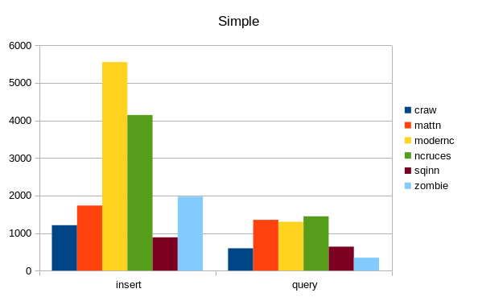
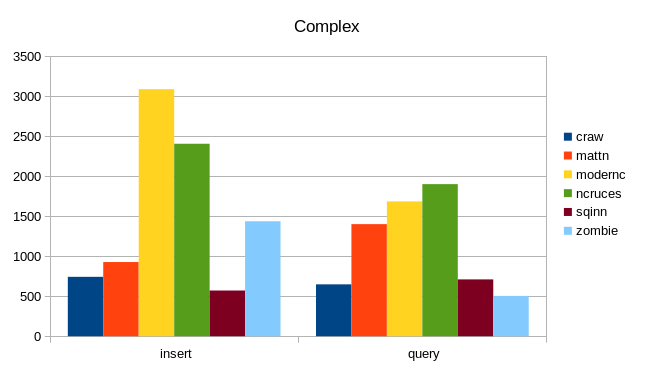

Benchmarks for Golang SQLite Drivers
==============================================================================

For benchmarks I used the following libraries:

- `github.com/mattn/go-sqlite3`, a CGO-based solution. This library is
  (still) the de-facto standard and widely used. 

- `modernc.org/sqlite`, a pure Go solution. This is a newer library,
  based on the SQLite C code re-written in Go.

- `crawshaw.io/sqlite`, a CGO-based solution. This is not a `database/sql` driver.

- `github.com/cvilsmeier/sqinn-go`, a solution without CGO. It uses
  `github.com/cvilsmeier/sqinn` to access SQLite database files.

The test setup is as follows:

- OS: Debian/GNU Linux amd64 version 12.2
- CPU: 11th Gen Intel(R) Core(TM) i7-1165G7 @ 2.80GHz, 4 physical cores, 8 logical cores
- RAM: 16GB
- Disk: 1TB NVME SSD
- go version go1.21.2 linux/amd64

The benchmark was run on 2023-10-08, with current library versions.

Database Schema
------------------------------------------------------------------------------

The test database consist of the following tables and indizes:

    PRAGMA foreign_keys=1;
    PRAGMA busy_timeout=5000;

    CREATE TABLE users (
        id INTEGER PRIMARY KEY NOT NULL,
        created INTEGER NOT NULL,
        email TEXT NOT NULL,
        active INTEGER NOT NULL);
    CREATE INDEX users_created ON users(created);

    CREATE TABLE articles (
        id INTEGER PRIMARY KEY NOT NULL,
        created INTEGER NOT NULL,  
        userId INTEGER NOT NULL REFERENCES users(id),
        text TEXT NOT NULL);
    CREATE INDEX articles_created ON articles(created);
    CREATE INDEX articles_userId ON articles(userId);

    CREATE TABLE comments (
        id INTEGER PRIMARY KEY NOT NULL,
        created INTEGER NOT NULL,
        articleId INTEGER NOT NULL REFERENCES articles(id),
        text TEXT NOT NULL);
    CREATE INDEX comments_created ON comments(created);
    CREATE INDEX comments_articleId ON comments(articleId);

Benchmarks
------------------------------------------------------------------------------

Result times are measured in milliseconds. Lower numbers indicate better
performance.

### Simple

Insert 1 million user rows in one database transaction.
Then query all users once.

                      insert        query
    -------------------------------------
    craw             1252 ms       617 ms
    cznic            5673 ms      1341 ms
    mattn            1734 ms      1223 ms
    sqinn             993 ms       664 ms

### Complex

Insert 200 users in one database transaction.
Then insert 20000 articles (100 articles for each user) in another transaction.
Then insert 400000 articles (20 comments for each article) in another transaction.
Then query all users, articles and comments in one big JOIN statement.

                       insert       query
    -------------------------------------
    craw               733 ms      668 ms
    cznic             3198 ms     1633 ms
    mattn              921 ms     1397 ms
    sqinn              638 ms      731 ms

### Many

Insert N users in one database transaction.
Then query all users 1000 times.
This benchmark is used to simluate a read-heavy use case.

            query/N=10  query/N=100  query/N=1000
    --------------------------------------------------------
    craw         14 ms        63 ms        524 ms
    cznic        35 ms       136 ms       1160 ms
    mattn        30 ms       123 ms       1106 ms
    sqinn        22 ms        67 ms        671 ms

### Large

Insert 10000 users with N bytes of row content.
Then query all users.
This benchmark is used to simluate reading of large (gigabytes) databases.

          query/N=50000  query/N=100000  query/N=200000
    ---------------------------------------------------
    craw         197 ms          325 ms          645 ms
    cznic        283 ms          600 ms         1027 ms
    mattn        170 ms          310 ms          606 ms
    sqinn        573 ms         1095 ms         2769 ms

### Concurrent

Insert one million users.
Then have N goroutines query all users.
This benchmark is used to simulate concurrent reads.

            query/N=2  query/N=4  query/N=8
    ---------------------------------------
    craw       696 ms    1098 ms    1793 ms
    cznic     2831 ms    7068 ms   17940 ms
    mattn     1544 ms    1763 ms    3337 ms
    sqinn      832 ms    1395 ms    2451 ms

Summary
------------------------------------------------------------------------------

In benchmark 'Large', sqinn is slower than the other drivers: Shuffling
gigabytes of data over stdin/out takes time.

In all other benchmarks, craw and sqinn are the fastest solutions, while
mattn is a bit slower, and cznic is much slower, especially when used
concurrently.
