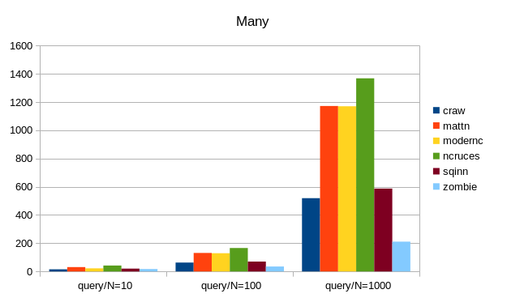
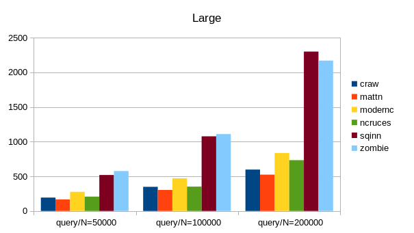
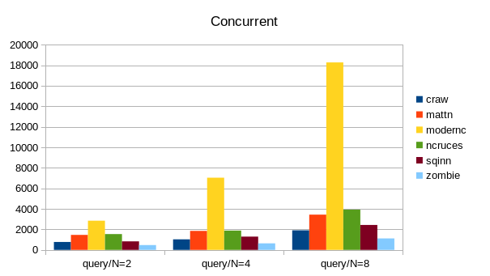

Benchmarks for Golang SQLite Drivers
==============================================================================

This work is sponsored by Monibot - Easy Server and Application Monitoring.
Try out Monibot at [https://monibot.io](https://monibot.io?ref=go-sqlite-bench).
It's free.

For benchmarks I used the following libraries:

- craw, `crawshaw.io/sqlite`, a CGO-based solution. This is not a `database/sql` driver.

- mattn, `github.com/mattn/go-sqlite3`, a CGO-based solution. This library is
  (still) the de-facto standard and widely used. 

- modernc, `modernc.org/sqlite`, a pure Go solution. This is a newer library,
  based on the SQLite C code re-written in Go.

- ncruces, `github.com/ncruces/go-sqlite3`, a pure Go solution based on WASM (?). 

- sqinn, `github.com/cvilsmeier/sqinn-go`, a solution without CGO. It uses
  `github.com/cvilsmeier/sqinn` to access SQLite database files.

- zombie, `github.com/zombiezen/go-sqlite`, a rewrite of the crawshaw driver, using the
  modernc libraries. This is not a `database/sql` driver.

The test setup is as follows:

- OS: Debian/GNU Linux amd64 version 12.3
- CPU: 11th Gen Intel(R) Core(TM) i7-1165G7 @ 2.80GHz, 4 physical cores, 8 logical cores
- RAM: 16GB
- Disk: 1TB NVME SSD
- go version go1.21.5 linux/amd64

The benchmark was run on 2023-12-09, with then-current library versions.
See go.mod for library versions. Each test was run once for warmup.
The second run was then recorded.

A general note on benchmarks:

Do not trust benchmarks, write your own. This specific benchmark is modelled
after my very own database usage scenarios. Your scenarios may be totally
different.

Database Schema
------------------------------------------------------------------------------

The test database consist of the following tables and indizes:

    PRAGMA journal_mode=DELETE;
    PRAGMA synchronous=FULL;
    PRAGMA foreign_keys=1;
    PRAGMA busy_timeout=5000;

    CREATE TABLE users (
        id INTEGER PRIMARY KEY NOT NULL,
        created INTEGER NOT NULL,
        email TEXT NOT NULL,
        active INTEGER NOT NULL);
    CREATE INDEX users_created ON users(created);

    CREATE TABLE articles (
        id INTEGER PRIMARY KEY NOT NULL,
        created INTEGER NOT NULL,  
        userId INTEGER NOT NULL REFERENCES users(id),
        text TEXT NOT NULL);
    CREATE INDEX articles_created ON articles(created);
    CREATE INDEX articles_userId ON articles(userId);

    CREATE TABLE comments (
        id INTEGER PRIMARY KEY NOT NULL,
        created INTEGER NOT NULL,
        articleId INTEGER NOT NULL REFERENCES articles(id),
        text TEXT NOT NULL);
    CREATE INDEX comments_created ON comments(created);
    CREATE INDEX comments_articleId ON comments(articleId);

Benchmarks
------------------------------------------------------------------------------

Result times are measured in milliseconds. Lower numbers indicate better
performance.

### Simple

Insert 1 million user rows in one database transaction.
Then query all users once.

                      insert        query
    -------------------------------------
    craw             1234 ms       608 ms
    mattn            1537 ms      1267 ms
    modernc          5557 ms      1379 ms
    ncruces         10073 ms      6080 ms
    sqinn             883 ms       641 ms
    zombie           1862 ms       325 ms

### Complex

Insert 200 users in one database transaction.
Then insert 20000 articles (100 articles for each user) in another transaction.
Then insert 400000 comments (20 comments for each article) in another transaction.
Then query all users, articles and comments in one big JOIN statement.

                       insert       query
    -------------------------------------
    craw               729 ms      667 ms
    mattn              911 ms     1387 ms
    modernc           3211 ms     1633 ms
    ncruces           5159 ms     5380 ms
    sqinn              574 ms      709 ms
    zombie            1400 ms      507 ms

### Many

Insert N users in one database transaction.
Then query all users 1000 times.
This benchmark is used to simluate a read-heavy use case.

            query/N=10  query/N=100  query/N=1000
    --------------------------------------------------------
    craw         14 ms        65 ms        520 ms
    mattn        30 ms       130 ms       1143 ms
    modernc      35 ms       135 ms       1180 ms
    ncruces     185 ms       829 ms       7230 ms
    sqinn        25 ms        83 ms        619 ms
    zombie       17 ms        36 ms        225 ms

### Large

Insert 10000 users with N bytes of row content.
Then query all users.
This benchmark is used to simluate reading of large (gigabytes) databases.

          query/N=50000  query/N=100000  query/N=200000
    ---------------------------------------------------
    craw         197 ms          346 ms          624 ms
    mattn        168 ms          290 ms          591 ms
    modernc      276 ms          514 ms          888 ms
    ncruces      244 ms          391 ms          789 ms
    sqinn        519 ms         1085 ms         2264 ms
    zombie       552 ms         1071 ms         2198 ms

### Concurrent

Insert one million users.
Then have N goroutines query all users.
This benchmark is used to simulate concurrent reads.

            query/N=2  query/N=4  query/N=8
    ---------------------------------------
    craw       692 ms    1100 ms    1873 ms
    mattn     1516 ms    1840 ms    3483 ms
    modernc   2889 ms    7144 ms   18674 ms
    ncruces   8268 ms   12710 ms   25792 ms
    sqinn      854 ms    1411 ms    2460 ms
    zombie     367 ms     646 ms    1140 ms

Summary
------------------------------------------------------------------------------

- We cannot declare a winner, it all depends on the use case.
- Crawshaw and Zombiezen are pretty fast.
- Mattn, although the de-facto standard, is not the best overall solution.
- SQLite without CGO is possible.

This work is sponsored by Monibot - Easy Server and Application Monitoring.
Try out Monibot at [https://monibot.io](https://monibot.io?ref=go-sqlite-bench).
It's free.
